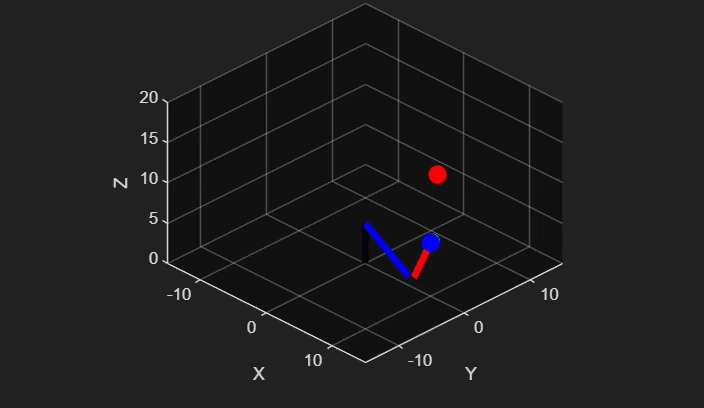

# Robotic Arm Kinematics Assembly & Path Trace

## Project Overview

This project presents the complete mathematical modeling and simulation of a **3-DOF Articulated (RRR) Robotic Arm** developed entirely in MATLAB. The robotic manipulator is modeled using the **Denavit-Hartenberg (D-H) convention**, enabling systematic representation of joint transformations and precise computation of the end-effector pose through homogeneous transformation matrices.

The project further implements a closed-form **Analytical Inverse Kinematics (IK)** solution based on geometric trigonometry and the Law of Cosines, allowing the robot to determine the required joint angles for any reachable Cartesian target. A smooth pick-and-place simulation is achieved by generating a linear trajectory between user-defined coordinates, animating the robotic arm in real time while tracing the end-effector path in a 3D workspace.

---

## Simulation Preview



---

## Objectives

- Model a 3-DOF articulated robotic manipulator using the Denavit-Hartenberg convention.
- Construct homogeneous transformation matrices for each robotic joint.
- Implement Forward Kinematics to determine the end-effector pose.
- Develop an Analytical Inverse Kinematics solver using geometric methods.
- Validate workspace reachability before solving inverse kinematics.
- Generate a smooth pick-and-place trajectory using Cartesian interpolation.
- Animate robotic arm movement in a 3D MATLAB environment.
- Trace the end-effector trajectory throughout the simulation.

---

## Robot Configuration & Architecture

The robotic manipulator consists of three revolute joints arranged in an **RRR (Revolute-Revolute-Revolute)** configuration.

### Link Dimensions

| Link | Description | Length |
|------|-------------|--------|
| L1 | Base Vertical Offset | 5 units |
| L2 | Upper Arm | 8 units |
| L3 | Forearm | 6 units |

The first joint rotates the entire arm around the vertical axis, while the second and third joints position the manipulator within a vertical plane to achieve accurate end-effector positioning.

### Key Kinematics Parameters

| Link | θ | d | a | α |
|------|------|------|------|------|
| 1 | θ₁ | L₁ = 5 | 0 | 90° |
| 2 | θ₂ | 0 | L₂ = 8 | 0° |
| 3 | θ₃ | 0 | L₃ = 6 | 0° |

---

## Methodology

### 1. D-H Transformation Matrix Formulation

Each robotic joint is represented using the standard Denavit-Hartenberg homogeneous transformation matrix.

```math
A_i=
\begin{bmatrix}
\cos\theta & -\sin\theta\cos\alpha & \sin\theta\sin\alpha & a\cos\theta\\
\sin\theta & \cos\theta\cos\alpha & -\cos\theta\sin\alpha & a\sin\theta\\
0 & \sin\alpha & \cos\alpha & d\\
0 & 0 & 0 & 1
\end{bmatrix}
```

The overall robot transformation is obtained as

```math
T_0^3=A_1A_2A_3
```

---

### 2. Forward Kinematics (FK)

Forward Kinematics computes the end-effector position and orientation from the supplied joint angles.

The overall transformation matrix is obtained by multiplying

```math
T=A_1A_2A_3
```

The resulting Cartesian coordinates become

```math
x=\cos(\theta_1)\left(L_2\cos\theta_2+L_3\cos(\theta_2+\theta_3)\right)
```

```math
y=\sin(\theta_1)\left(L_2\cos\theta_2+L_3\cos(\theta_2+\theta_3)\right)
```

```math
z=L_1+L_2\sin\theta_2+L_3\sin(\theta_2+\theta_3)
```

This transformation maps joint space into operational Cartesian space.

---

### 3. Analytical Inverse Kinematics (IK)

Given a desired Cartesian target

```text
(X, Y, Z)
```

the first joint angle is computed using

$$
\theta_1=\mathrm{atan2}(Y,X)
$$

The planar distance is

```math
r=\sqrt{X^2+Y^2}
```

Vertical displacement

```math
s=Z-L_1
```

Using the Law of Cosines,

```math
D=\frac{r^2+s^2-L_2^2-L_3^2}{2L_2L_3}
```

Workspace validation is performed using

```matlab
if abs(D) > 1
    error('Target point is outside the robot workspace.');
end
```

The remaining joint angles are then calculated analytically for the elbow-up configuration using geometric trigonometry.

---

### 4. Trajectory Generation & Linear Path Tracing

A smooth Cartesian trajectory is generated between the Pick and Place coordinates using MATLAB's `linspace()` function.

Each coordinate axis is divided into **50 equally spaced interpolation points**, producing a continuous linear path for the end-effector.

For every interpolated point:

1. Cartesian coordinates are generated.
2. Analytical Inverse Kinematics computes the required joint angles.
3. Forward Kinematics validates the resulting pose.
4. The robot is animated in real time.

---

### 5. 3D Wireframe Animation

The simulation is visualized using MATLAB graphics functions.

- `clf` refreshes the animation frame.
- `plot3` renders the robotic links.
- `scatter3` highlights the Pick point, Place point, and End-Effector.
- The trajectory history is continuously plotted to visualize the complete motion path.

The result is a dynamic real-time animation of the robotic manipulator performing a pick-and-place operation.

---

## Mathematical Foundations

The robot workspace is constrained by the total physical length of the manipulator.

Maximum Reach

```math
L_1+L_2+L_3=5+8+6=19
```

The first joint projects the target into the XY plane,

```math
r=\sqrt{X^2+Y^2}
```

while the remaining two joints solve the planar positioning problem using geometric relationships.

Workspace validation is performed before solving the inverse kinematics to ensure unreachable targets are safely rejected when

```math
|D|>1
```

This guarantees mathematically valid solutions and stable robot motion.

---

## Project Structure

```
RoboticArmKinematics/
│
├── main.m
├── dh_transform.m
├── forward_kinematics.m
├── inverse_kinematics.m
├── plot_robot.m
├── simulation_animation.gif
└── README.md
```

---

## Conclusion

This project demonstrates the complete implementation of robotic manipulator kinematics, from mathematical modeling using Denavit-Hartenberg parameters to real-time trajectory execution and visualization. The successful simulation validates analytical geometric kinematic theory and provides a strong foundation for future applications in industrial automation, robotic manipulation, and autonomous motion planning.

---

## Author

**Aimash Waheed**

**Robotics & Automation | Embedded Systems | Kinematics Modeling**
